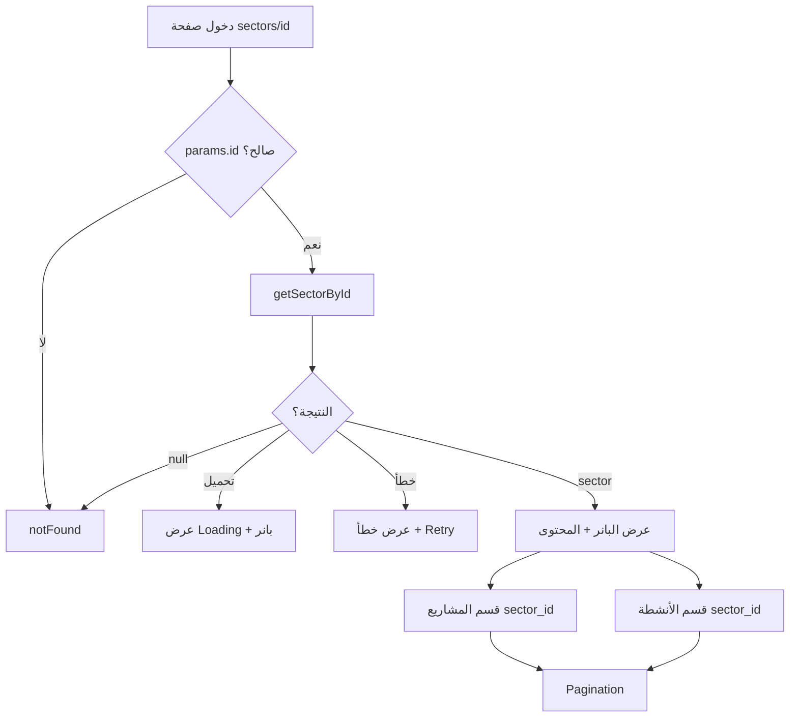

# خطة صفحة تفاصيل القطاع (Sector Detail)

## ما تم التحقق منه من البيلد القديم

من تحليل [Design/oldbuild/Sector.html](Design/oldbuild/Sector.html) وملف الـ JS [Design/oldbuild/_next/static/chunks/app/Sector/page-9c42294b1395d9b6.js](Design/oldbuild/_next/static/chunks/app/Sector/page-9c42294b1395d9b6.js):

- **المسار القديم**: `/Sector?id={id}` (معرّف القطاع كـ query param).
- **API القطاع الواحد**: `GET https://app.mosaic-hrd.org/api/sectors/{id}` مع هيدر `Accept-Language: locale`، والاستجابة تحتوي على `data` من نوع `SectorItem` (id, name, color, description, image, created_at).
- **محتوى الصفحة**:

  1. **بانر**: شعار + عنوان (أثناء التحميل: "Sector Details"؛ بعد التحميل: اسم القطاع).
  2. **حالات**: تحميل (Loading)، خطأ (مع زر Retry)، عدم وجود قطاع (sectorNotFound / sectorNotFoundMessage).
  3. **المحتوى الرئيسي**: صورة بطول الصفحة (hero)، ثم اسم القطاع ووصف HTML (مع إزالة وسمي img و hr من الوصف).
  4. **أقسام مرتبطة بالقطاع**:

     - **المشاريع**: `GET /api/projects/paginated?sector_id={id}&...` — 4 عناصر في الصفحة، روابط إلى صفحة المشروع (في القديم: `/Education?id=...`؛ في الجديد: `/[locale]/projects/[id]`).
     - **الأنشطة**: مكوّن يستخدم `sector_id` (مطابق لـ `getActivitiesPaginated` مع `sectorId`).

في البناء الجديد، الرابط من [AboutSectors.tsx](components/sections/AboutSectors.tsx) موجود بالفعل إلى `/${locale}/sectors/${sector.id}`، لذا المسار المستهدف هو **مسار ديناميكي بالمعرّف**: `[locale]/sectors/[id]`.

---

## المكونات المطلوبة

### 1. API: جلب قطاع واحد

- **الملف**: [lib/api/sectors.ts](lib/api/sectors.ts).
- **الإضافة**: دالة `getSectorById(id: string, locale: string)` تستدعي `GET https://app.mosaic-hrd.org/api/sectors/{id}` مع الهيدرات المعتادة (Accept, Content-Type, Accept-Language).
- **الاستجابة**: نفس واجهة `SectorsResponse` لكن `data` يكون عنصراً واحداً؛ التعامل مع `data` كـ `SectorItem | SectorItem[]` إن لزم (وفق سلوك الـ API الفعلي).
- **معالجة الأخطاء**: في حال فشل الطلب أو عدم وجود بيانات، إرجاع `null` مع تسجيل الخطأ في الـ console.

**ملاحظة**: إن لم يكن لدى الـ API endpoint لقطاع واحد، يمكن كبديل جلب القائمة عبر `getSectors(locale)` والبحث عن العنصر الذي `item.id === Number(id)` أو `String(item.id) === id`.

### 2. API: المشاريع حسب القطاع

- **الملف**: [lib/api/projects.ts](lib/api/projects.ts).
- **التعديل**: إضافة معامل اختياري `sectorId: string = ''` إلى `getProjectsPaginated`، وإضافته إلى `URLSearchParams` باسم `sector_id` عند عدم كونه فارغاً (مثل ما هو معمول به في [lib/api/activities.ts](lib/api/activities.ts) لـ `sector_id`).
- إذا تأكد لاحقاً أن الـ API لا يدعم `sector_id` للمشاريع، يمكن إخفاء قسم المشاريع أو جلب كل المشاريع وعرضها دون فلتر (يُحدد حسب توثيق الـ API).

### 3. المسار والصفحة

- **المسار**: `app/[locale]/sectors/[id]/page.tsx`.
- **النوع**: Client Component (`'use client'`) لاستخدام useState/useEffect وجلب البيانات حسب `params.id` و `params.locale` (مع التعامل مع أن `params` قد يكون Promise في Next.js 15 إن وُجد).
- **السلوك**:
  - جلب القطاع عبر `getSectorById(id, locale)`.
  - حال التحميل: عرض [Loading](components/common/Loading.tsx) مع بانر بسيط (مثلاً عنوان "تفاصيل القطاع" / "Sector Details").
  - حال الخطأ: عرض رسالة خطأ وزر "إعادة المحاولة" (Retry) يعيد استدعاء الجلب.
  - إن كان القطاع `null` بعد انتهاء التحميل: استدعاء `notFound()`.
  - عند وجود القطاع: عرض البانر (اسم القطاع)، ثم المحتوى الرئيسي ثم الأقسام الفرعية.

### 4. واجهة المستخدم (UI)

- **البانر**: منطقة علوية بلون أو صورة خلفية (من لون القطاع `sector.color` أو صورة القطاع)، مع اسم القطاع كنص واضح، ومتناسق مع باقي الموقع (مثل [app/[locale]/projects/[id]/page.tsx](app/[locale]/projects/[id]/page.tsx) من حيث الارتفاع والألوان).
- **زر الرجوع**: رابط إلى `/[locale]/about` أو قائمة القطاعات (نفس المصدر)، بنفس أسلوب "العودة إلى المشاريع" في صفحة تفاصيل المشروع.
- **المحتوى الرئيسي**:
  - صورة القطاع (إن وُجدت) باستخدام مكوّن `Image` من Next.js مع `sizes` و`fill` أو أبعاد ثابتة مناسبة، ووضع loader حسب قواعد المشروع.
  - عنوان (h2) باسم القطاع.
  - وصف HTML عبر `dangerouslySetInnerHTML` بعد تنقية اختيارية: إزالة أو السماح لوسمات `img` و`hr` حسب الحاجة (القديم كان يزيلها من الوصف).
- **قسم المشاريع**:
  - عنوان القسم من القاموس (مثل `dict.nav.projects`).
  - جلب المشاريع عبر `getProjectsPaginated(page, '', '', '', 4, locale, sectorId)` مع `sectorId = id`.
  - عرض البطاقات في شبكة (مثلاً 4 أعمدة على الشاشات الكبيرة) مع صورة، اسم، وربط إلى `/[locale]/projects/[project.id]`.
  - Pagination عند الحاجة (نفس نمط صفحة تفاصيل المشروع).
- **قسم الأنشطة**:
  - عنوان من القاموس (مثل `dict.nav.activities`).
  - جلب عبر `getActivitiesPaginated(page, '', '', id, '', 4, locale)`.
  - عرض البطاقات مع روابط إلى `/[locale]/activities/[activity.id]`.
  - Pagination بنفس النمط.

يُنصح بإعادة استخدام أنماط البطاقات والـ Pagination من [app/[locale]/projects/[id]/page.tsx](app/[locale]/projects/[id]/page.tsx) للحفاظ على تناسق التصميم (ألوان، ظلال، hover، أحجام الصور).

### 5. الترجمة (i18n)

- **الملفات**: [lib/i18n/messages/ar.json](lib/i18n/messages/ar.json) و [lib/i18n/messages/en.json](lib/i18n/messages/en.json).
- **المفاتيح المقترحة** (تحت كائن مشترك أو تحت `sector` إن وُجد):
  - عنوان الصفحة أثناء التحميل: مثل `sectorDetail.loadingTitle` ("تفاصيل القطاع" / "Sector Details").
  - القطاع غير موجود: `sectorDetail.notFound` و `sectorDetail.notFoundMessage`.
  - خطأ التحميل: `sectorDetail.errorMessage` و `sectorDetail.retry`.
  - "العودة إلى": مثل `sectorDetail.backToAbout` أو استخدام رابط "من نحن" مع نص "العودة إلى من نحن".

### 6. التحقق من الصورة

- التأكد من أن [next.config.js](next.config.js) يسمح بنطاق صور الـ API (mosaic-hrd.org / app.mosaic-hrd.org) إن كانت صورة القطاع من نفس النطاق.

---

## تدفق الصفحة (مختصر)

---

## ترتيب التنفيذ المقترح

1. إضافة `getSectorById` في `lib/api/sectors.ts` (والتحقق من استجابة الـ API أو استخدام fallback من القائمة).
2. إضافة معامل `sectorId` إلى `getProjectsPaginated` في `lib/api/projects.ts` إن كان الـ API يدعمه.
3. إضافة مفاتيح الترجمة لصفحة تفاصيل القطاع في `ar.json` و `en.json`.
4. إنشاء `app/[locale]/sectors/[id]/page.tsx` مع كل الحالات (loading, error, notFound, محتوى + مشاريع + أنشطة مع pagination).
5. اختبار المسار من صفحة "من نحن" عبر الضغط على "تعرف أكثر" لأحد القطاعات والتأكد من التنسيق والـ RTL/LTR.

لا حاجة بتعديل [AboutSectors.tsx](components/sections/AboutSectors.tsx) لأن الرابط `/${locale}/sectors/${sector.id}` موجود مسبقاً.